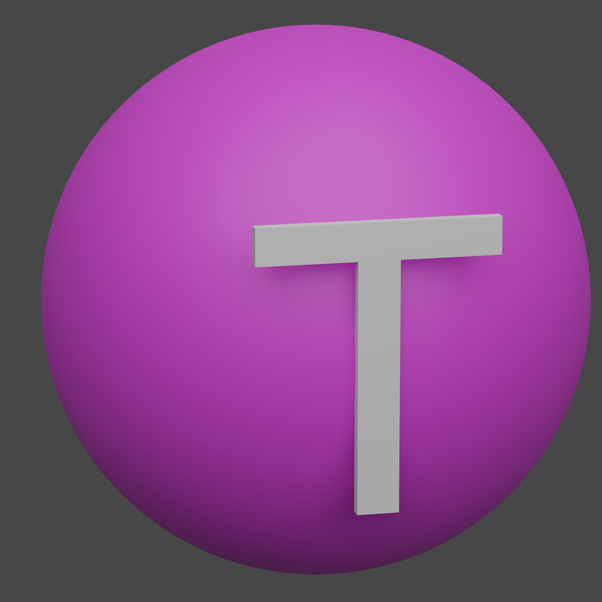

<div id="top"></div>

[![Contributors][contributors-shield]][contributors-url]
[![Stargazers][stars-shield]][stars-url]
[![Forks][forks-shield]][forks-url]
[![Issues][issues-shield]][issues-url]
[![MIT License][license-shield]][license-url]


<!-- PROJEKT LOGGA -->
<br />
<div align="center">
  <a href="https://github.com/LeonHellqvist/unikum-tools">
    
  </a>

<h3 align="center">Unikum Tools</h3>

  <p align="center">
    <b>Ingen kopplning med Unikum (inofficiellt)</b>
    <br />
    Ett tillägg som gör Unikum trevligare att använda
    <br />
    <a href="https://chrome.google.com/webstore/category/extensions"><strong>Chrome Web Store » </strong></a><a href="https://addons.mozilla.org/sv-SE/firefox/"><strong>Firefox Addons (stöds inte än)</strong></a>
    <br />
    <br />
    <a href="https://youtube.com">Visa demo</a>
    ·
    <a href="https://github.com/LeonHellqvist/unikum-tools/issues">Rapportera bugg</a>
    ·
    <a href="https://github.com/LeonHellqvist/unikum-tools/issues">Be om funktion</a>
  </p>
</div>


<!-- INNEHÅLLSFÖRTECKNING -->
<details>
  <summary>Innehållsförteckning</summary>
  <ol>
    <li>
      <a href="#om-projektet">Om projektet</a>
      <ul>
        <li><a href="#byggt-med">Byggt med</a></li>
      </ul>
    </li>
    <li>
      <a href="#komma-igång">Komma igång</a>
      <ul>
        <li><a href="#förutsättningar">Förutsättningar</a></li>
        <li><a href="#installation">Installation</a></li>
      </ul>
    </li>
    <li><a href="#användnings-exempel">Använding</a></li>
    <li><a href="#roadmap">Roadmap</a></li>
    <li><a href="#bidra">Bidra</a></li>
    <li><a href="#licens">Licens</a></li>
    <li><a href="#kontakt">Kontakt</a></li>
  </ol>
</details>


<!-- OM PROJEKTET -->
## Om projektet

[![Product Name Screen Shot][product-screenshot]](https://example.com)

Unikum Tools är ett tillägg för både Chrome och Firefox (stöds inte än) som gör att du kan använda Unikum på ett trevligare sätt.

<p align="right">(<a href="#top">Tillbaka till toppen</a>)</p>


### Byggt med

* [React.js](https://reactjs.org/)
* [Vite](https://vitejs.dev/)
* [CRXJS Vite plugin](https://crxjs.dev/vite-plugin/)
* [MUI](https://mui.com/)

<p align="right">(<a href="#top">Tillbaka till toppen</a>)</p>


<!-- KOMMA IGÅNG -->
## Komma igång

Det här är ett exempel på hur du kan sätta upp projektet. Följ bara dessa instruktioner för att få igång en lokal kopia.

### Förutsättningar

Om du inte redan har NPM så måste du installera det först

### Installation

1. Klona den här repon
   ```sh
   git clone https://github.com/LeonHellqvist/unikum-tools.git
   ```
2. Installera NPM paket (Finns konflikter just nu pga ny React version (18))
   ```sh
   npm install --legacy-peer-deps
   ```
3. Starta utvecklingsmiljön
   ```sh
   npm run dev
   ```
4. Importera tillägget till din webbläsare. (Från "dist" mappen)<br />
  [Chrome](https://developer.chrome.com/docs/extensions/mv3/getstarted/#unpacked)<br />
  [Firefox (stöds inte än)](https://developer.mozilla.org/en-US/docs/Mozilla/Add-ons/WebExtensions/Your_first_WebExtension#installing)

<p align="right">(<a href="#top">Tillbaka till toppen</a>)</p>


<!-- ANVÄNDNINGSEXEMPEL -->
## Användnings exempel

[![Product Name Screen Shot][ButtonCustomizer]](https://example.com)

Här kan vi se alternativ sidan användas för att ändra utseende på bokmärkerna

_För mer exempel, kolla in [demo](https://youtube.com)_

<p align="right">(<a href="#top">Tillbaka till toppen</a>)</p>


<!-- ROADMAP -->
## Roadmap

- [ Firefox stöd ] Väntar på Firefox då detta inte kan fixas av oss se [Bugzilla](https://bugzilla.mozilla.org/show_bug.cgi?id=1247687)

Se [öppna issues](https://github.com/LeonHellqvist/unikum-tools/issues) för en full lista av föreslagna funktioner (och kända problem).

<p align="right">(<a href="#top">Tillbaka till toppen</a>)</p>


<!-- BIDRA -->
## Bidra

Bidrag är det som gör communityn med öppen källkod så bra. Alla bidrag du gör är **mycket uppskattade**.

Om du har en idé som skulle göra det här bättre, forka repon och skapa en pull request. Du kan också bara öppna en issue med taggen "förbättring".
Glöm inte att ge projektet en stjärna, tack så mycket!

1. Forka projektet
2. Skapa din funktions Branch (`git checkout -b funktion/OtroligFunktion`)
3. Committa dina ändringar (`git commit -m 'Lägg till nån OtroligFunktion'`)
4. Pusha branchen (`git push origin funktion/OtroligFunktion`)
5. Öppna en pull request

<p align="right">(<a href="#top">Tillbaka till toppen</a>)</p>


<!-- LICENS -->
## Licens

Distribuerad under GNU General Public License v3.0. Se `LICENSE` för mer information.

<p align="right">(<a href="#top">Tillbaka till toppen</a>)</p>


<!-- KONTAKT -->
## Kontakt

Leon Hellqvist - Discord: NisseV2#6585

Projektlänk: [https://github.com/LeonHellqvist/unikum-tools](https://github.com/LeonHellqvist/unikum-tools)

<p align="right">(<a href="#top">Tillbaka till toppen</a>)</p>


<!-- TACK TILL -->
## Tack till

[Othneil Drew](https://github.com/othneildrew) - som inspererade denna README

Projektlänk: [https://github.com/othneildrew/Best-README-Template](https://github.com/othneildrew/Best-README-Template)

<p align="right">(<a href="#top">Tillbaka till toppen</a>)</p>


<!-- MARKDOWN LINKS & IMAGES -->
<!-- https://www.markdownguide.org/basic-syntax/#reference-style-links -->
[contributors-shield]: https://img.shields.io/github/contributors/LeonHellqvist/unikum-tools.svg?style=for-the-badge
[contributors-url]: https://github.com/LeonHellqvist/unikum-tools/graphs/contributors
[forks-shield]: https://img.shields.io/github/forks/LeonHellqvist/unikum-tools.svg?style=for-the-badge
[forks-url]: https://github.com/LeonHellqvist/unikum-tools/network/members
[stars-shield]: https://img.shields.io/github/stars/LeonHellqvist/unikum-tools.svg?style=for-the-badge
[stars-url]: https://github.com/LeonHellqvist/unikum-tools/stargazers
[issues-shield]: https://img.shields.io/github/issues/LeonHellqvist/unikum-tools.svg?style=for-the-badge
[issues-url]: https://github.com/LeonHellqvist/unikum-tools/issues
[license-shield]: https://img.shields.io/github/license/LeonHellqvist/unikum-tools.svg?style=for-the-badge
[license-url]: https://github.com/LeonHellqvist/unikum-tools/blob/main/LICENSE.txt
[product-screenshot]: images/unikumExample.png
[buttonCustomizer]: images/buttonCustomizer.png
[settings]: images/settings.png
[menu]: images/settings.png
[bookmark]: images/bookmark.png
[food]: images/food.png
[schedule]: images/schedule.png
